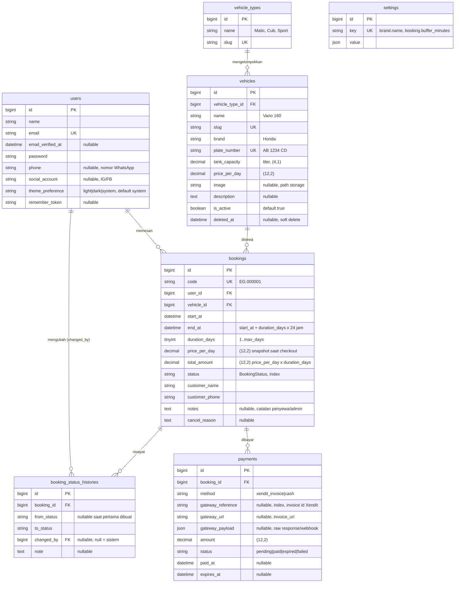

# ERD EduwGo

Struktur database final. Sumber kebenaran untuk migration (EG-3, EG-4, EG-6). Kalau ada perubahan kolom, ubah dokumen ini dulu, baru migration.

Konvensi:
- Semua tabel punya `id` (bigint unsigned, auto increment) dan `created_at` / `updated_at`.
- Uang: `decimal(12,2)`, dalam Rupiah, tanpa pajak.
- Waktu: `datetime`, timezone aplikasi `Asia/Jakarta`.
- Status disimpan sebagai `string`, nilainya dikunci oleh enum PHP (`App\Enums\BookingStatus`), bukan enum MySQL — supaya nambah status tidak perlu `ALTER TABLE`.
- Foreign key: `onDelete('restrict')` kecuali ditulis lain. Data transaksi tidak boleh hilang karena master dihapus.

## Diagram



Tabel role/permission (`roles`, `permissions`, `model_has_roles`, `model_has_permissions`, `role_has_permissions`) disediakan oleh `spatie/laravel-permission`, tidak digambar. Role yang dipakai hanya `admin` dan `user`.

## Detail per tabel

### users

Bawaan Breeze + 3 kolom tambahan (migration di EG-6).

| Kolom | Tipe | Null | Default | Keterangan |
|---|---|---|---|---|
| id | bigint unsigned | – | auto | |
| name | varchar(255) | – | | |
| email | varchar(255) | – | | unique |
| email_verified_at | timestamp | ✓ | null | wajib terisi sebelum checkout |
| password | varchar(255) | – | | hashed |
| phone | varchar(20) | ✓ | null | nomor WhatsApp, format 08xx / 62xx |
| social_account | varchar(100) | ✓ | null | username IG/FB, sesuai S&K |
| theme_preference | varchar(10) | – | `system` | `light` \| `dark` \| `system` |
| remember_token | varchar(100) | ✓ | null | |
| created_at, updated_at | timestamp | ✓ | | |

### vehicle_types

| Kolom | Tipe | Null | Keterangan |
|---|---|---|---|
| id | bigint unsigned | – | |
| name | varchar(50) | – | Matic, Cub, Sport |
| slug | varchar(50) | – | unique, dari name |
| created_at, updated_at | timestamp | ✓ | |

Tidak boleh dihapus jika masih dipakai `vehicles` (cek di controller, FK restrict).

### vehicles

| Kolom | Tipe | Null | Default | Keterangan |
|---|---|---|---|---|
| id | bigint unsigned | – | auto | |
| vehicle_type_id | bigint unsigned | – | | FK → vehicle_types.id, restrict |
| name | varchar(100) | – | | Vario 160 |
| slug | varchar(120) | – | | unique, dari name + plat |
| brand | varchar(50) | – | | Honda, Yamaha |
| plate_number | varchar(15) | – | | unique, disimpan uppercase |
| tank_capacity | decimal(4,1) | – | | liter |
| price_per_day | decimal(12,2) | – | | harga saat ini; booking pakai snapshot |
| image | varchar(255) | ✓ | null | path di disk `public`, `vehicles/xxx.jpg` |
| description | text | ✓ | null | |
| is_active | boolean | – | true | nonaktif = tidak tampil di katalog |
| deleted_at | timestamp | ✓ | null | soft delete (hanya jika sudah punya booking) |
| created_at, updated_at | timestamp | ✓ | | |

Status "Tersedia / Disewa" **bukan kolom**. Dihitung dari booking aktif (lihat bagian Ketersediaan).

### bookings

| Kolom | Tipe | Null | Default | Keterangan |
|---|---|---|---|---|
| id | bigint unsigned | – | auto | |
| code | varchar(20) | – | | unique, `EG.` + 6 digit, dari tabel `sequences` |
| user_id | bigint unsigned | – | | FK → users.id, restrict |
| vehicle_id | bigint unsigned | – | | FK → vehicles.id, restrict |
| start_at | datetime | – | | tanggal + jam mulai sewa |
| end_at | datetime | – | | `start_at + duration_days × 24 jam` |
| duration_days | tinyint unsigned | – | | 1..`setting('booking.max_days')` |
| price_per_day | decimal(12,2) | – | | **snapshot** dari vehicles saat checkout |
| total_amount | decimal(12,2) | – | | `price_per_day × duration_days` |
| status | varchar(20) | – | `pending` | nilai dari `BookingStatus`, index |
| customer_name | varchar(255) | – | | prefill dari users.name, bisa diubah |
| customer_phone | varchar(20) | – | | prefill dari users.phone, wajib |
| notes | text | ✓ | null | catatan penyewa saat checkout / catatan admin |
| cancel_reason | text | ✓ | null | wajib diisi saat → cancelled |
| created_at, updated_at | timestamp | ✓ | | |

Index tambahan: `(vehicle_id, status, start_at, end_at)` — dipakai query ketersediaan.

Nilai `status` (`App\Enums\BookingStatus`):

| Nilai | Label UI | Arti |
|---|---|---|
| pending | Pending | menunggu pembayaran, unit terkunci |
| paid | Lunas | sudah bayar, menunggu serah terima |
| rented | Sedang disewa | unit sudah diambil |
| returned | Sudah kembali | unit sudah dikembalikan, selesai |
| cancelled | Batal | dibatalkan user (saat pending) / admin |
| expired | Expired | lewat batas bayar 60 menit |

Transisi yang diizinkan (lihat SPEC bagian 6): pending → paid \| expired \| cancelled; paid → rented \| cancelled; rented → returned. Status **aktif** (mengunci unit) = pending, paid, rented.

### booking_status_histories

| Kolom | Tipe | Null | Keterangan |
|---|---|---|---|
| id | bigint unsigned | – | |
| booking_id | bigint unsigned | – | FK → bookings.id, cascade |
| from_status | varchar(20) | ✓ | null saat booking pertama dibuat |
| to_status | varchar(20) | – | |
| changed_by | bigint unsigned | ✓ | FK → users.id, set null; null = sistem (webhook/scheduler) |
| note | text | ✓ | alasan batal, catatan serah terima, "Terlambat dikembalikan", dll |
| created_at, updated_at | timestamp | ✓ | |

Hanya ditulis lewat `BookingService::transition()`. Untuk penanda overdue (EG-32), `from_status = to_status = rented` dengan note khusus.

### payments

| Kolom | Tipe | Null | Default | Keterangan |
|---|---|---|---|---|
| id | bigint unsigned | – | auto | |
| booking_id | bigint unsigned | – | | FK → bookings.id, cascade |
| method | varchar(20) | – | | `xendit_invoice` \| `cash` |
| gateway_reference | varchar(100) | ✓ | null | invoice id Xendit, index (dicari webhook) |
| gateway_url | varchar(500) | ✓ | null | invoice_url Xendit |
| gateway_payload | json | ✓ | null | response createInvoice / raw webhook terakhir |
| amount | decimal(12,2) | – | | |
| status | varchar(20) | – | `pending` | `pending` \| `paid` \| `expired` \| `failed` |
| paid_at | datetime | ✓ | null | dari payload Xendit atau `now()` untuk cash |
| expires_at | datetime | ✓ | null | sumber countdown di halaman Menunggu Pembayaran |
| created_at, updated_at | timestamp | ✓ | | |

Satu booking bisa punya beberapa payment (invoice expired lalu booking ulang → booking baru, bukan payment baru; tapi cash setelah invoice pending → 2 payment). Yang dipakai UI: `latestPayment` (created_at terbaru).

### settings

| Kolom | Tipe | Null | Keterangan |
|---|---|---|---|
| id | bigint unsigned | – | |
| key | varchar(100) | – | unique, dot-notation |
| value | json | – | scalar / string / array |
| created_at, updated_at | timestamp | ✓ | |

Diakses lewat helper `setting('key', $default)`, di-cache (`settings.all`), cache di-flush saat update dari halaman Pengaturan.

Key yang dipakai:

| Key | Default | Dipakai di |
|---|---|---|
| brand.name | EduwGo | layout, title |
| brand.tagline | Rental Motor Cepat & Aman, Mulai Rp75.000/hari | hero |
| brand.logo_light, brand.logo_dark, brand.favicon | null | layout |
| brand.primary_color, brand.accent_color | null (pakai token default) | override CSS var |
| contact.whatsapp | – | tombol Chat Admin (wa.me) |
| contact.address, contact.hours | – | footer, detail pemesanan |
| social.instagram, social.facebook, social.twitter | null | footer |
| booking.max_days | 5 | modal durasi |
| booking.invoice_minutes | 60 | Xendit invoice_duration, countdown |
| booking.buffer_minutes | 60 | AvailabilityService |
| content.terms | 6 poin S&K | home, modal S&K, /syarat-ketentuan |

### sequences (EG-27)

| Kolom | Tipe | Keterangan |
|---|---|---|
| name | varchar(50) | PK, contoh `booking_code` |
| value | bigint unsigned | nilai terakhir |

Diambil dengan `lockForUpdate()` di dalam transaksi checkout supaya kode booking tidak dobel saat request paralel.

## Ketersediaan unit (aturan query)

Unit `vehicle` **tersedia** untuk rentang `[start, end]` (end = start + days × 24 jam) jika **tidak ada** baris `bookings` yang memenuhi semua:

```
vehicle_id = :vehicle
AND status IN ('pending', 'paid', 'rented')
AND (start_at - INTERVAL buffer MINUTE) < :end
AND (end_at   + INTERVAL buffer MINUTE) > :start
```

`buffer` = `setting('booking.buffer_minutes', 60)`. Badge "Disewa" di katalog/admin = query yang sama dengan `start = end = now()`.

## Relasi Eloquent

| Model | Relasi |
|---|---|
| User | `hasMany(Booking)`, `hasMany(BookingStatusHistory, 'changed_by')`, `HasRoles` (spatie) |
| VehicleType | `hasMany(Vehicle)` |
| Vehicle | `belongsTo(VehicleType, 'vehicle_type_id')`, `hasMany(Booking)`, `SoftDeletes` |
| Booking | `belongsTo(User)`, `belongsTo(Vehicle)`, `hasMany(BookingStatusHistory)`, `hasMany(Payment)`, `latestPayment(): hasOne(Payment)->latestOfMany()` |
| BookingStatusHistory | `belongsTo(Booking)`, `belongsTo(User, 'changed_by')` |
| Payment | `belongsTo(Booking)` |
| Setting | – (diakses via helper) |

## Urutan migration

1. `users` (Breeze) + tambah kolom (EG-6)
2. spatie permission tables (EG-6)
3. `vehicle_types` (EG-3)
4. `vehicles` (EG-3)
5. `settings` (EG-3)
6. `bookings` (EG-4)
7. `booking_status_histories` (EG-4)
8. `payments` (EG-4)
9. `sequences` (EG-27)

Urutan penting karena FK. Seeder: Role → User → VehicleType → Vehicle → Setting → Booking.
